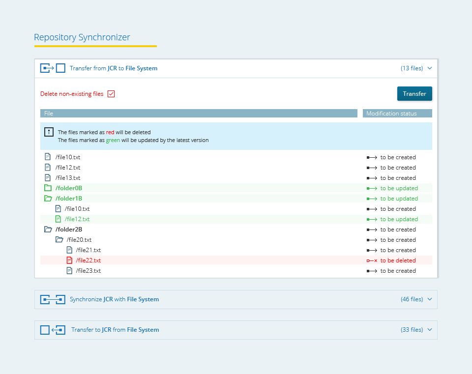

Pentaho Repository Synchronizer (PRS)
=====================================

The **Pentaho Repository Synchronizer (PRS)** is a Pentaho plugin that allows you to interact with the solution repository of Pentaho 5.0 by keeping the disk-based file structure synchronized with the Pentaho internal solution repository (JCR).

Dashboards
==========

PRS UI is made of a single dashboard where all the action takes place. 

In a first stage, the location of the disk-based solution folder will assume default values but it can nevertheless be configured in an external file (or it can by itself justify adding a second dashboard to PRS UI).

Dashboard 
---------

### Goal

The dashboard must give user access to the differences between the actual disk-based Pentaho solution and the JCR. Mainly it consists on a table listing the different items (files changed, new files and deleted files) and a few action buttons to control the synchronization. 

### UX Mock-up 

### Actions

The dashboard contains a set of three *actions*:

* _Export from JCR_: copy the repository status from JCR to the file system solution folder;
* _Import to JCR_: copy the file system solution folder status to JCR;
* _Synchronize JCR with File System_: merges JCR with the file system solution folder and save it on both locations;

and one *global option*:

* _delete_: a checkbox stating if non-existing files on the origin repository should be deleted on the destination repository.

The dashboard also contains a *table*, which will be shown when the user chooses one of the previous three actions, listing the existing differences to be committed. This table should contain the *Id* (path starting on repo location + filename), the *modification status* (*to be deleted*, *to be modified* or *to be created*) for each item (file or directory) listed. It should also contain a column with a visual insight about the *direction of modifications migration* (i.e. if the specific item is being copied from JCR to the file system or vice-versa). this last column should be relevant in case the user has chosen to "synchronize" the repositories).

Additionally, when the table is shown, two confirmation buttons should appear: _"Ok"_ and _"cancel"_.

_Remark 1_: the items in the table for which the corresponding modification status is *to be deleted* should be displayed on the table and processed by the endpoint only in the case the delete checkbox (see above) is ticked.

_Remark 2_: the three main buttons (_Export from JCR_, _Import to JCR_ and _Synchronize JCR with File System_), should have a visual insight on the direction of the modification (e.g..: an arrow from JCR to File System for the export button, and arrow from the File System to JCR for the import button and a bidirectional arrow linking both JCR and FS).

### Navigation

* whenever an action button (synchronize, export or import) is clicked, the table containing the changes to be committed should be shown;
* when the table is shown a set of confirmation buttons ( OK / Cancel ) should also appear;
* the table should be hidden when one of the confirmation buttons had been clicked.

### Endpoints

The set of Endpoints for the PRS dashboard are:

* previewDifferences;
* sync.

Endpoints
=========

These endpoints were mentioned in the previous section. Here, we have a
"detailed" description of each one of them:
	
* previewDifferences
	* Description: List the differences on the origin repository in relation to the destination repository. _Remark_: as mentioned earlier, the items in the list for which the corresponding modification status is *to be deleted* should be displayed only in the case the parameter deleteBoolean (see below) is set to true;
	* Parameters: originRepoLocation, destinationRepoLocation, deleteBoolean (stating if files on the destination repo that do not exist on the origin repo should be deleted or not), selectedAction (stating if the selected action was "Synchronize JCR with File System", "Export from JCR" or "Import to JCR");
	* Output: table containing all changed files/directories. Should contain the *Id* (path starting on repo location + filename), the *modification status* (*to be deleted*, *to be modified* or *to be created*) for each item (file or directory) listed. Additionally some kind of *"direction status"* information, stating from which repository to which repository the changes are being mirrored for each item, should be present (e.g..: the data from kettle could be the originRepoLocation value). The output should also contain the type of element (file or folder) of each item.

	
* syncRepositories
	* Description: Copy the origin repository status to the destination repository or merge the repositories (depending on the chosen action). Attention should be paid to the deleteBoolean parameter status (see remark above); 
	* Parameters: originRepoLocation, destinationRepoLocation, deleteBoolean (stating if files on the destination repository that do not exist on the origin repository should be deleted or not) and selectedAction (stating if the selected action was "Synchronize JCR with File System", "Export from JCR" or "Import to JCR");
	* Output: (operation status).
	
_Remark_: At the moment a third endpoint named _previewDifferences2_ can be found in the folder "/endpoints/kettle". This endpoint uses the real JCR location and can be tested on Pentaho 5.0.
	
